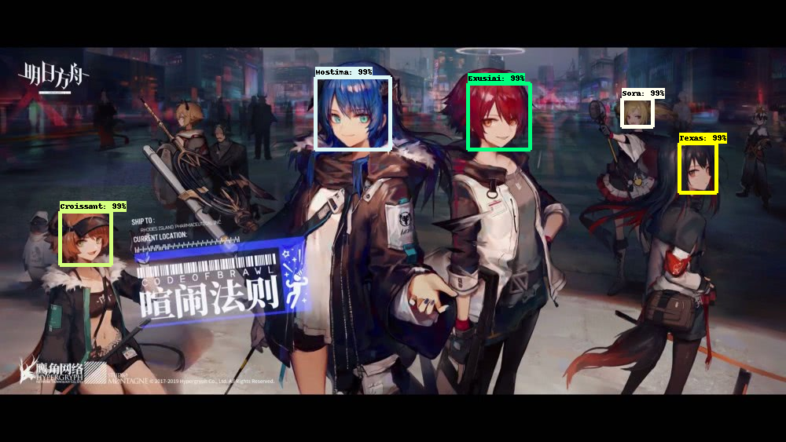
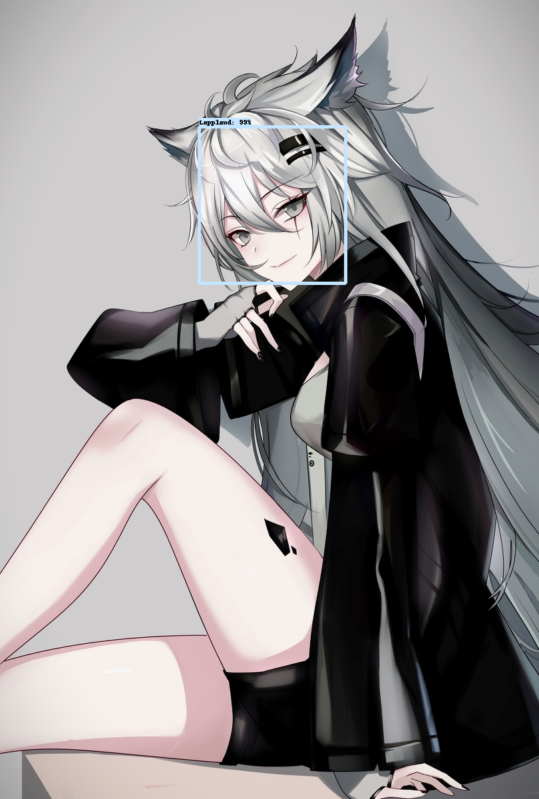
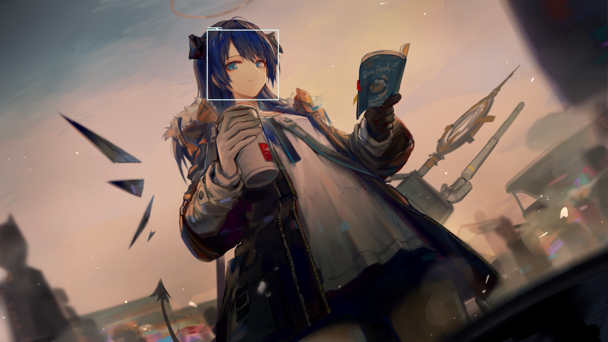

# Arknights_Penguin_Logistics_Operators_Face_Detection
With Tensorflow Object Detection API

This project is continued from [this](https://github.com/lLoLii/Arknights_Mostima_Exusiai_Face_Detector).
That means this is still my first project.

The last one was with just 2 classes, but I upgraded the model to detect 4 more classes. (6 Operators from Arknights)

Also, Thanks to [this article]( https://medium.com/analytics-vidhya/training-an-object-detection-model-with-tensorflow-api-using-google-colab-4f9a688d5e8b )
and [this repo]( https://github.com/EdjeElectronics/TensorFlow-Object-Detection-API-Tutorial-Train-Multiple-Objects-Windows-10) for helping me a lot.

And thank you for noticing this repo!

I am still a newbie to this subject so please forgive me for everything i have mistaken!
[Project files here!](https://drive.google.com/drive/folders/105nms8RskhqjGDtkl5JlSgIU_rEauHTs?usp=sharing)

[วิธีการ(Thai)](https://medium.com/@phusitsom/%E0%B8%AA%E0%B8%AD%E0%B8%99%E0%B9%83%E0%B8%AB%E0%B9%89%E0%B9%82%E0%B8%A1%E0%B9%80%E0%B8%94%E0%B8%A5%E0%B8%95%E0%B8%A3%E0%B8%A7%E0%B8%88%E0%B8%88%E0%B8%B1%E0%B8%9A%E0%B8%A7%E0%B8%B1%E0%B8%95%E0%B8%96%E0%B8%B8%E0%B8%94%E0%B9%89%E0%B8%A7%E0%B8%A2-tensorflow-object-detection-api-%E0%B8%9A%E0%B8%99-google-colab-d55153aca505)

Outputs

